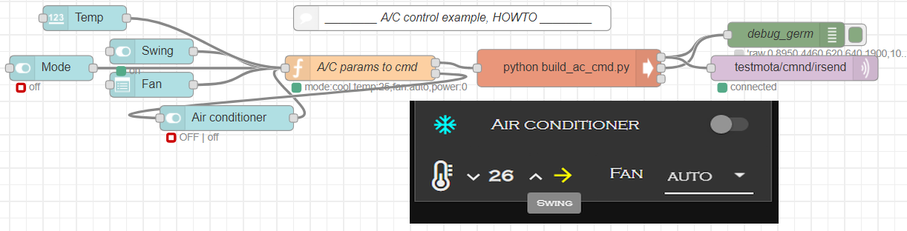

# Air Conditioner control

## Purpose
Control A/C unit via Infrared (IR) from ESP8266.

## Implementation
UI in Node-Red --> Command generation in script --> Send command via MQTT --> Transmit the IR command from ESP8266
- A/C commands are gathered into a Database in build_ac_cmd.py. Add your own commands and algorithms.
- From UI or internal logic the build_ac_cmd.py generates proper command to be send to required A/C model. If the A/C is off then any change in UI (temperature, mode, swing, fan) turns it on. Why? I thought that's comfortable. :-)
- The MQTT transfers the command to proper ESP8266 module.
- The ESP8266, running Tasmota in this case (however, Homie is my favorite, running in other cases), transmits the command with IR. 

All this is possible to do directly on RasPi without ESP8266 if your RasPi is in direct visibility from A/C remote receiver and has free IO.

## Hardware
- The ESP8266 and RasPi are able to drive IR LEDs @ current of about 10mA. This is enough in ~60cm distance of IR receiver.
- For longer distances the current [amplification is needed](http://www.learningaboutelectronics.com/Articles/LED-driver-circuit.php).
- Calculate the current limiting resistor to ~50mA. The IR LED won't burn due to very short use time. The LED drop voltage is about 1.3V. Transistor drop voltage is about 0.8V. 
- You can put 2-3 LEDs in series, depending of your VCC, recalculate the resistor.

## Software


- Once loaded Node-Red JSON, read the comment HOWTO to fit the flow with your setup.
- Put the build_ac_cmd.py into /home/pi/ folder. Not must, just recommended to make it executable (```chmod 755 /home/pi/build_ac_cmd.py```). 
- Test the IR sending from command line.
  1. Generate the IR command with build_ac_cmd.py.
  1. Transmit it with ```mosquitto_pub -t <topic_to_your_ESP8266> -m <the_IR_command>```
  
## Adding more A/C untis
Putting here some info, since it was painful process for me. Maybe this will relief some pain for others.
1. The optimal way to decode the IR is using Tasmota.
1. Once Tasmota loaded and running, choose IRrecv to the IO where the IR receiver connected.
1. Run in Tasmota console or MQTT full reporting of IR codes: ```SetOption58 1```
1. Record some sommands.
1. Gather Raw data from reports of Tasmota into CSV file.
1. Using ircode2bin.py try to convert the raw data into stream.
1. Comparing similar commands (temperature + 1 degree, on/off, fan1/2/3) you can find the bit encoding --> so decode the protocol. Sometimes this doesn't work, so just keep all the IR commands is certain calssification. Example for both (decoded and raw) is given in build_ac_cmd.py.
1. Share your findings with the community.
