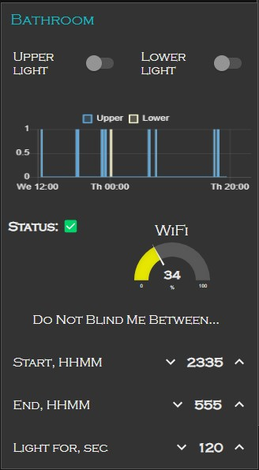

# Bathroom light switch

## Why?
- Why turn lights on and off manually? Why care of light at all? It must be automatic.
- At night time: 
  * sometimes hard to find the switch :)
  * the strong upper light dazzles;
  * the strong upper light reduces melatonin level and causes awakeness;

## What?
What could be done:
- Use simple time relay over the PIR. Daylight saving changes require manual update. PIR needs light-sensing mod.
- 2 separate PIRs with 2 separate relays. Too much wires, too expensive. Not fun.
- Sonoff Dual + modded PIR + Homie-based firmware + Node-RED based UI = full control and fun.

The solution consists of:
- Sonoff Dual R2 (any Sonoff Dual is OK with slight changes).
- AM312 PIR sensor.
- Some simple electronic parts, [see schematics](https://github.com/igrowing/esp8266_smart_home_ready/blob/master/modules/bathroom%20light%20switch/hardware/bathroom_light.pdf).
- Your preferred ambient lighting foŕthe bathroom.
- AC/DC LED driver 12V 1W.
- Short strip of LEDs at your preferred color. I like blue color to keep myself asleep during the moonwalk to the bathroom.
- Some wires :)


## How?
How to solder, connect the hardware, compile and flash the firmware - the easy part.
How to import the flow into the Node-Red, it's even easier.

How to control it over MQTT - the fun part!

On the boot, the ESP8285 asks from the Node-Red the current local time.
```
homie/dual_r2/bathroom/time 3567
homie/dual_r2/bathroom/time/set 1676326906216
```
Once the ESP knows the time it can decide when to run which light.

* When you enter the bathroom and there is naturla light there, the ESP does not turn the light on. In this case, the modded PIR just does not inform the ESP about human presence.

  > Once an hour the ESP asks for time update and returns the current status. You can request the status anytime:
```
moquitto_pub -t homie/dual_r2/bathroom/status/set -m true

homie/dual_r2/bathroom/offtime-start-hhmm 2335
homie/dual_r2/bathroom/offtime-end-hhmm 555
homie/dual_r2/bathroom/power1 false
homie/dual_r2/bathroom/power2 false
homie/dual_r2/bathroom/on-time-s 120
homie/dual_r2/bathroom/status time: 22:21
homie/dual_r2/bathroom/status last run reason: 0
```
* When you enter dark bathroom out of "non blind" hours, then all lights are on. This is retriggering action - while there is movement in the bathroom the lights are on. There is configurable timeout on movement to keep lights on while no more movements. Default is 2 minutes.
```
moquitto_pub -t homie/dual_r2/bathroom/on-time-s/set -m 120
```
* When you enter dark bathroom out of "non blind" hours, then only lower weak lights are on.



From the Node-Red GUI you can see the lighting log, turn each light on/off. This looks as following in MQTT:
```
moquitto_pub -t homie/dual_r2/bathroom/power1/set -m toggle
homie/dual_r2/bathroom/power1 true
homie/dual_r2/bathroom/status 1

moquitto_pub -t homie/dual_r2/bathroom/power2/set -m toggle
homie/dual_r2/bathroom/power2 true
homie/dual_r2/bathroom/status 1

Status enumeration:
0 - Automatic, PIR driven;
1 - via MQTT;
2 - manual - read below.
```

Setting the blind time window can be done via the GUI or via MQTT:
```
moquitto_pub -t homie/dual_r2/bathroom/offtime-start-hhmm/set -m 2335
moquitto_pub -t homie/dual_r2/bathroom/offtime-end-hhmm/set -m 555
```

Well, Sonoff has 1 built-in button. It could not left without attention. Frankly, the controller is hidden. So likely no one will click the button... But the funtionality is there:
- Single click: toggle the lower (weak) light;
- Double click: toggle the upper (strong) light;
- Triple click: send the status to MQTT.
