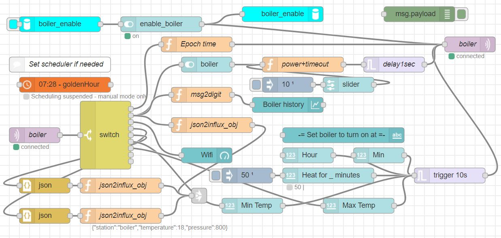
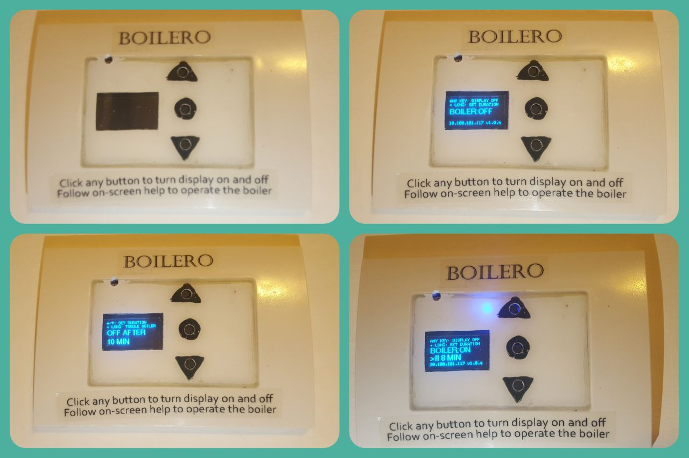
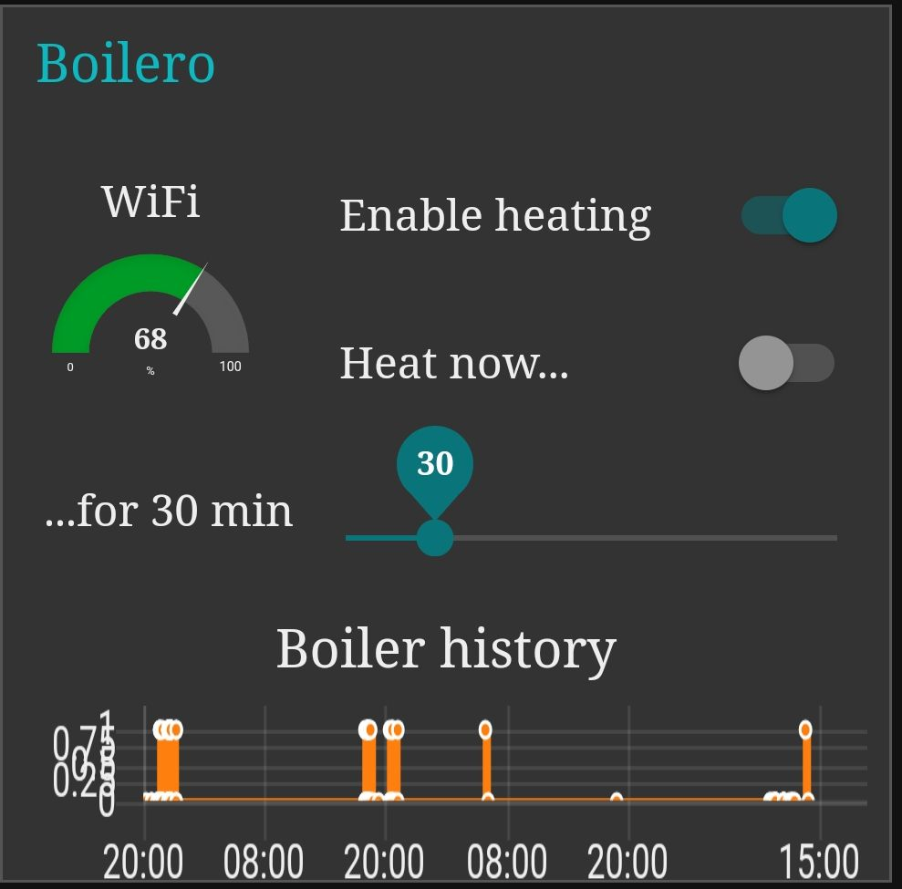
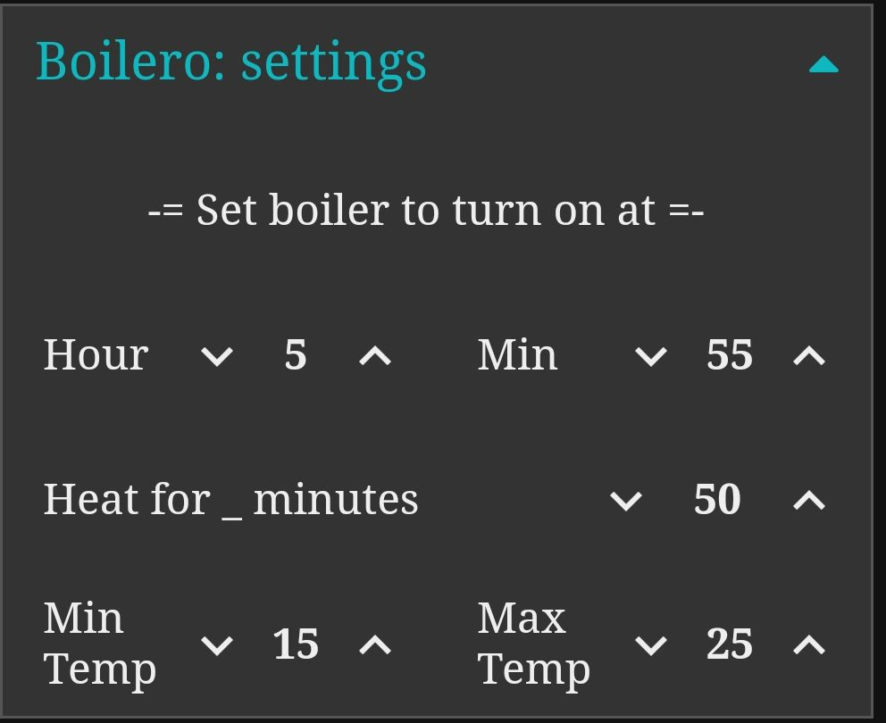

# Boilero: another yet "perfect" boiler controller #
<!-- TOC -->

- [Boilero: another yet "perfect" boiler controller](#boilero-another-yet-perfect-boiler-controller)
    - [Story](#story)
    - [Features](#features)
    - [Human interface and operation](#human-interface-and-operation)
        - [Initialization](#initialization)
        - [Physical UI/UX](#physical-uiux)
        - [Graphical UI/UX](#graphical-uiux)
    - [MQTT communication](#mqtt-communication)
    - [Discussion](#discussion)
        - [Lightweight NTP replacement over MQTT](#lightweight-ntp-replacement-over-mqtt)
        - [ls and cat to SPIFFS over MQTT](#ls-and-cat-to-spiffs-over-mqtt)
        - [Open questions / problems](#open-questions--problems)

<!-- /TOC -->

## Story ##
My old good mechanical timer for boiler passed away recently. I repaired it about month ago... and this time it's dead completely. 
I could buy ready product "Switcher" dedicated for remote control of boiler. 
However, this type of "smart" devices does not make sense to my [concept of smart home](https://github.com/igrowing/esp8266_smart_home_ready). 
I could use sonoff with 16A relay and I thought it's too close to boiler consumption, so risky... 
Meanwhile I've build a "perfect" boiler controller and I could load Tasmota on it... The time it would take me to learn and set all options and rules to reach required functionality would be approx. the same as write from scratch a program with Homie. 

## Features ##
- 30A relay overrated enough for any boiler.
- EMI and surge protection.
- OLED display, 3 buttons, and multicolor LED as user interface.
- GUI on Node-RED via hub on Raspberry-Pi. Accessible/visible from mobile phone or computer in LAN or outside of home.
- MQTT reported/controlled.
- Controlled by hardware buttons too.
- Programmable network independent timer. The timer is self-adjusting to season, heating more on winter and less in summer. The adjustment rate is configurable too.
- Enhanced LED signaling: 
  - LED becomes 'hotter' while water is heating, incrementally changing the color from blue to red.
  - (TODO) If the boiler has reached max. temperature and not heating then LED is flashing red meanwhile relay should be on. In this state, the relay is actually off, keeping the electrical wiring of the boiler out of voltage.
  - If the boiler is on without timer (manually or via MQTT) the red LED flashes as reminder.
  - Flashing blue LED while trying to connect to Wifi.
- Advanced measurement:
  - Current reported periodically while boiler is on.
  - Energy consumption reported every end of boiler run time.
  - Alert about power consumption when relay should be off and there is current: contact slip, hardware problem.
  - Air temperature (used for auto-adjustment of timer).
  - (TODO) Air pressure (used for auto-adjustment of timer).

Node-Red flow, the UI presented below.




## Human interface and operation ##
### Initialization
Once the firmware is uploaded and the module is powered on, the Homie-xxxxxx AP will appear. It might take a minute or two if you use brand new ESP8266 with unwritten Flash. Homie will format the SPIFFS first.

* Open Homie init portal: http://marvinroger.github.io/homie-esp8266/configurators/v2/
* Switch your computer or cellphone to that Homie-AP.
* Look in the portal when the new device will be recognized. This takes 5-25 secs.
* Follow step-by-step on-screen instructions. DO NOT change the MQTT base name, leave it blank to avoid a bug in Homie. Allow OTA.
* Once the setup finished, switch back to your regular network: now you'll Homie reports in your MQTT broker.

Alternatively, [few more methods of initialization explained](https://igrowing.livejournal.com/229070.html).

### Physical UI/UX ###
The Boilero is controlled with 3 buttons:
- :arrow_up_small:
- :radio_button:
- :arrow_down_small:



The OLED display normally is off. When it is on, 2 upper lines show context help. The bottom line shows extra status. The middle of display shows function details.

- When display is off, click on any button turns it on.
- When display is in Status mode, it changes the content of the screen every 3 seconds. Click on any button in Status mode turns the display off.
- When display is in Status mode, long click on the :radio_button: swtiches the Boilero into Duration setting mode.
- When display is in Duration setting mode, the buttons :arrow_up_small: and :arrow_down_small: change the boiler run time for manual operation. **Notice:** Manual time setting does not affect automated scheduling time and calculation of adapted time for heating. Automated time is controlled via UI (or via MQTT).
- When display is in Duration setting mode, the long click on :radio_button: toggles boiler. I.e. if boiler was off, it will turn on for set time. Or if the boiler was on it will turn off with no relation to set time.
- When display is in Duration setting mode, the click on :radio_button: turns display off.
- In any mode, not touching buttons in 2 minutes shuts the display off. This prolongs display service time.
- In any boiler status change, controlled remotely or/and automatically, the display is lit for 2 minutes to show the status.

The Boilero is equipped with color LED. 
- When the boiler is off, the LED is off.
- When the boiler is started heating, the LED is changing its color from blue to red gradually. **Notice** The change looks like from cold to hot. However, this does not reflect real temperature of water in the boiler.
- When the boiler is on but there is no current consumtion, the LED flashes red. Maybe water is already hot, or heating element is burnt.
- When the Boilero is not connected to Wifi, the LED is flashing blue.

### Graphical UI/UX ###
The UI is implemented with Red-Node.




Rarely needed settings use the MQTT underneath.



## MQTT communication ##
Service messages: topic and value examples shown.
```
homie/boiler/$online true/false
homie/boiler/$stats/signal 100
homie/boiler/$stats/uptime 608
```

Boilero settings and properties:
```
homie/boiler/boiler/$properties 
current,
status,
alert,
time-increment-m:settable,
factory-reset:settable,
repeat-on-h:settable,
repeat-on-m:settable,
repeat-for:settable,
heat-now-m:settable,
temp-min-c:settable,
temp-max-c:settable,
time2run:settable,
suspend:settable,
weather:settable,
reset:settable,
time:settable,
cat:settable,
on:settable,
ls:settable,
```

How boilero requests Linux Epoch time update:
```
homie/boiler/boiler/time 8004                 // Request from Boilero
homie/boiler/boiler/time/set 1584216972715    // Response in seconds (not in ms!) from MQTT broker
```

Examples of statuses and alerts:
```
homie/boiler/boiler/on true/false                                // On relay status change
homie/boiler/boiler/current {"current_ma":13813,"power_w":3176}  // While relay is on
homie/boiler/boiler/current {"energy_kwh":0.5}                   // By turning off the relay
...
homie/boiler/boiler/alert Current of 1960 mA detected while boiler is off   // While relay is off
...
homie/boiler/boiler/repeat-on-h 5                                // Settings reported by boot
homie/boiler/boiler/repeat-on-m 55
homie/boiler/boiler/repeat-for 55
homie/boiler/boiler/heat-now-m 20
homie/boiler/boiler/time-incremrent-m 10
homie/boiler/boiler/temp-max-c 25
homie/boiler/boiler/temp-min-c 14
homie/boiler/boiler/suspend false
...
Periodic weather report, or tiggered by MQTT request:
homie/boiler/boiler/weather/set true                      
homie/boiler/boiler/weather {"temperature":23,"min_temp":23,"pressure":1008,"time":"20:16"}
```

Weird/dangerous MQTT functions:
```
homie/boiler/boiler/time2run/set true                // Request from MQTT broker to show scheduler status
homie/boiler/boiler/time2run {"now":"20:16","run":"05:55","in":"09:39"}
...
homie/boiler/boiler/ls/set true                      // Request from MQTT broker to list files on SPIFFS
homie/boiler/boiler/status /var_start_time_h / 1
homie/boiler/boiler/status /var_start_time_m / 2
homie/boiler/boiler/status /var_total_relay_time_ms / 7
homie/boiler/boiler/status /homie/config.json / 280
...
homie/boiler/boiler/cat/set true                     // Request from MQTT broker to show content of files on SPIFFS
homie/boiler/boiler/status /var_start_time_h : 5
homie/boiler/boiler/status /var_start_time_m : 55
homie/boiler/boiler/status /var_total_relay_time_ms : 3300000
homie/boiler/boiler/status /homie/config.json : {"name":"Boiler","device_id":"boiler","device_stats_interval":600,"wifi":{"ssid":"XXXX","password":"XXXX"},"mqtt":{"host":"XXXX","port":1883},"ota":{"enabled":true}}
...
homie/boiler/boiler/reset/set true          // Request from MQTT broker to reset Boilero
...
homie/boiler/boiler/factory-reset/set true  // Request from MQTT broker to wipe all settings in Boilero. This must be followed with initialization process
```

## Discussion ##

In this project following things might be interesting for developers:

### Lightweight NTP replacement over MQTT ###
Why:

NTP works on ESP8266 with Homie. However, it takes too much resource and makes OTA getting stuck in the middle. This makes OTA impossible and impractical.

How it works:
- When Homie is connected:
  1. Periodic time_timer started with 1 hour update. This is for case the time was not received from MQTT broker.
  2. The 'time' topic sent to MQTT broker, requesting the epoch time. Once epoch time is received and set, the time_timer is set to update the epoch time every week. **Important** In order to process the peoch time properly, the current timezone should be added at the MQTT proker before responding to Boilero. As well the epoch time should be sent in seconds, not in milliseconds: this allows to operate it in 4 byte variable in ESP8266.
- Every time the epoch time received, extract from epoch time the local hour and minute. Keep a diff with millis(). In loop compare the updated diff with requested hour to start the heating.

Alternative solution is:
- Add RTC. Use NTP or MQTT to get initial epoch time. Set the time to RTC. Disable the NTP. Then OTA will be OK and time will correct.

I missed this choice since more HW needed.

### ls and cat to SPIFFS over MQTT ###

### Open questions / problems ###
- Reading of BMP180 is bad. Standard example of different libraries are used. I stopped on Adafuit, just because its popularity: maybe other developers encountered this problem and found the solution. If so, please, share. **Sharing is caring!** The lib reads Temperature properly every time. But the pressure is read correctly only the very first time after ESP8266 boot. I thought this might be related to intereferrence with OLED display sitting on the same bus. Removing of OLED does not help. Other projects use the same OLED SSD1306 and BMP180 and report stable readings.
- Pressure can be received from other units in the smart home which don't experience the conflict above. Other units use BME280 and BME680. Question here: what's recommended values for cloud prediction? How fast and in which ranges the pressure should change to say about cloud gathering in given area? More clouds -> less sun -> more heating needed.