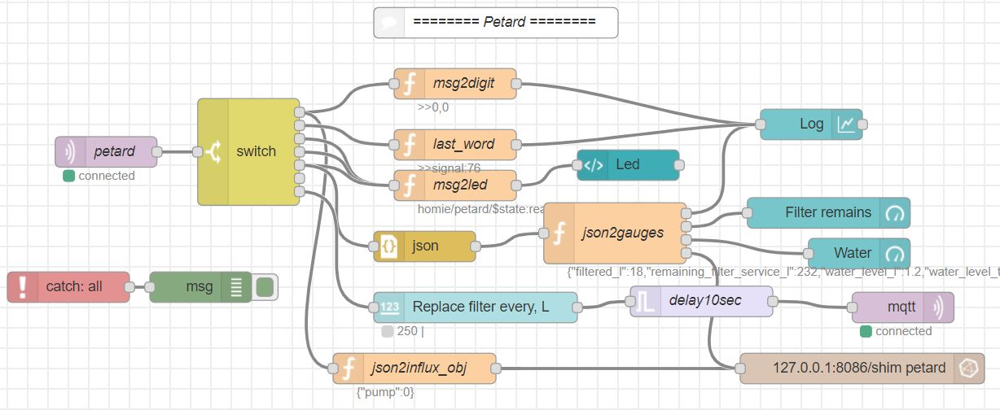
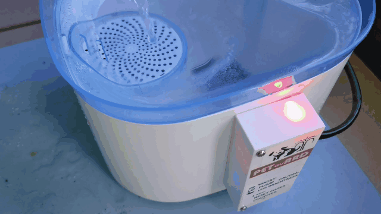
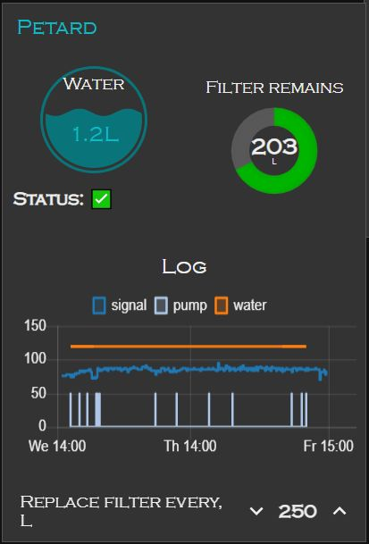
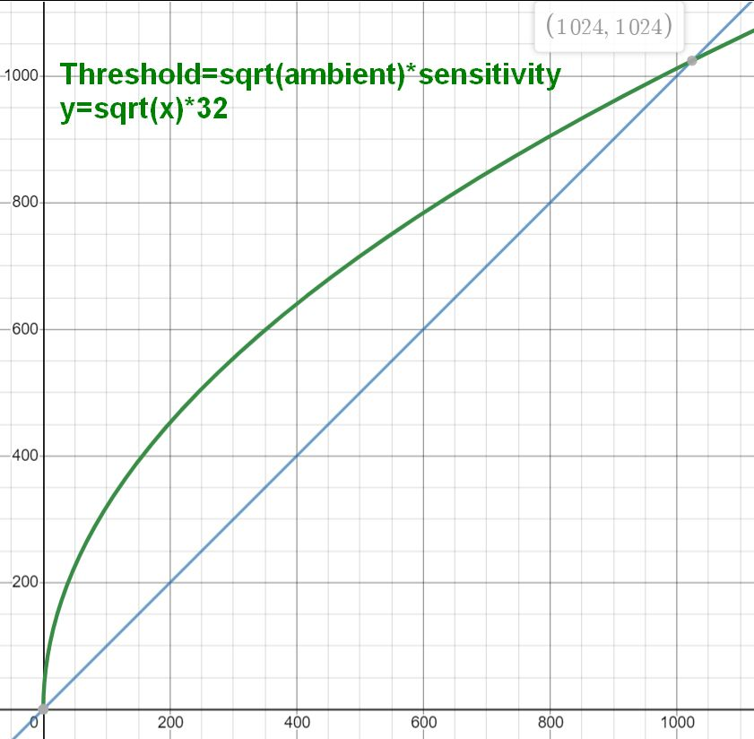

# Petard: another yet "perfect" pet fountain #


Table of contents:
- [Petard: another yet "perfect" pet fountain](#petard-another-yet-perfect-pet-fountain)
  - [Story](#story)
  - [Features](#features)
  - [Human interface and operation](#human-interface-and-operation)
    - [Initialization](#initialization)
    - [Physical UI/UX](#physical-uiux)
    - [Graphical UI/UX](#graphical-uiux)
  - [MQTT communication](#mqtt-communication)
  - [Hardware](#hardware)
  - [Discussion](#discussion)
    - [IR proximity detector](#ir-proximity-detector)
    - [ls and cat to SPIFFS over MQTT](#ls-and-cat-to-spiffs-over-mqtt)
    - [Open issues](#open-issues)


## Story ##
Keeping pet's water bowl clean and full with fresh water is a hassle for busy people.
When water is not fresh the pet drinks less and feels worse.
When the water gone and the owner missed that the pet gets in trouble.
To avoid those situation the industry produces large variety of mechanical and electronic pet fountains.
Running water attracts pets, therefore they drink more.
And the most of such fountains have built in filter, so the water is always fresh.
After long market search I found [a pet fountain with the best features](https://www.amazon.com/WellToBe-Fountain-Infrared-Dispenser-Automatic/dp/B089Y8143T/ref=sr_1_3):
- Battery backup;
- Large container;
- Good filter;
- Automatic pet detection.

After several weeks of use, part of complaints of other users confirmed with the fountain. So I decided to upgrade it.
Here is the pet fountain on steroids. Now it's beginning of 2021. It would be great to see similar feature set in commercially available fountain in 2023...
Now you can make it yourself ;)

And it's Petard because it is PET's guARD. It helps to the pet being hydrated and healthy.


## Features ##
The list below shows problems in the original pet fountain and how it was solved.

- **Problem:** The original pet fountain was stuck every 2-3 days, displaying teal light on its LED, not reacting to the pet, and not giving the water. Manual power cycle exited the logic inside the fountain from the stuck mode. This is really annoying and possibly not repairable without fix in the fountain firmware. However, the firmware update is not possible too for all models in the market today, including this fountain.
  - **Solution:** The microcontroller of the pet fountain was replaced with ESP8266. Dedicated firmware was written. Now the ESP8266 controls the pet and water level detection, pump work, reports and alerts. As well, the Web-UI added using Node-RED to see what's going on remotely and neatly, not for geeks ;-)
- **Problem:** Filter of the fountain required to be replaced every 2 weeks. Replacement by time makes no sense. Replacement by amount of filtered water does. However, it's another hassle to remember when to replace the filter.
  - **Solution:** Configure filter service life in Liters. When the pet fountain pumped through the filter enough water, it sends to the pet owner request of filter replacement.
- **Problem:** When water is gone red LED is lit on the fountain. If owner misses the indication, pet goes thirsty.
  - **Solution:** Measure water level and display it on the LED with rainbow colors from Blue (full) to Red (empty). Send preliminary alert to the pet owner about a day before water ends. Send assertive alert to the pet owner when water is gone.
- **Problem:** When you fill the container, the water level isn't seen. So you must either open it or add less water than possible. Spill of water isn't option because it goes straight to the electronics...
  - **Solution:** Follow the colorful LED: stop filling water when the LED becomes blue.
- **Problem:** When you fill the container, the fountain is activated from the your proximity. This makes the filling process long and annoying.
  - **Solution:** Detect the pet owner is filling the container with water and do not activate the pump.
- **Problem:** Working long hours you cannot know what's status of the water and the pet. And if trouble happens, you cannot know when it happened and what exactly went there.
  - **Solution:** Report via MQTT the pet fountain state: water level, pump on/off, filter service time. All the data can be stored in the database (InfluxDB in my case) and reviewed/analyzed later.

Node-Red flow shows essential data as Web-UI and stores the data to remote InfluxDB:



## Human interface and operation ##
### Initialization
Once the firmware is uploaded and the module is powered on, the Homie-xxxxxx AP will appear. It might take a minute or two if you use brand new ESP8266 with unwritten Flash. Homie will format the SPIFFS first.

* Open Homie init portal: http://marvinroger.github.io/homie-esp8266/configurators/v2/
* Switch your computer or cellphone to that Homie-AP.
* Look in the portal when the new device will be recognized. This takes 5-25 secs.
* Follow step-by-step on-screen instructions. DO NOT change the MQTT base name, leave it blank to avoid a bug in Homie. Allow OTA.
* Once the setup finished, switch back to your regular network: now you'll Homie reports in your MQTT broker.

Alternatively, [few more methods of initialization explained](https://igrowing.livejournal.com/229070.html).

### Physical UI/UX ###
The Petard has 1 colorful LEd and 1 button.
The LED functions as water level meter, from red (empty) through all colors of rainbow to blue (full).
Flashing red LEd means the water level meter is broken and service needed.
White LED means the Petard is in booting process. This should not take longer than 2-5 sec from the very first power on.

The button functions as:
- Short click - change LED brightness in loop: weak, medium, strong. As well, run the pump for 10 seconds and stop it if clicked before 10 seconds end. The Petard status is sent too via MQTT.
- Long click (more than 0.5 sec) - reset filter service time. Long click to be used when Petard sent alert "Replace filter". The acknowledge of long click is white LED for 3 seconds.
- Very long click (more than 10 seconds) - reset Petard to factory defaults.

When filling water, notice the LED color. When it becomes blue stop water filling immediately to avoid spill of the water into electronics.




### Graphical UI/UX ###
The Web-UI:



The "Status" sign shows overall Petard status:
- Green - normal function.
- Yellow - Alert sent to the pet owner, action required.
- Red - Petard is off or broken or inaccessible. Take care of your pet immediately.

The log graph shows Petard usage in past 2 days:
- Water level change;
- When pump was activated;
- WiFi signal quality.

The parameters are exposed as "Settings" in [MQTT communication](#mqtt-communication)

## MQTT communication ##
Service messages: topic and value examples shown.
```
homie/petard/$state ready/dead
homie/petard/$stats/signal 76
homie/petard/$stats/uptime 605
```

Petard settings and properties:
```
homie/petard/pf1/$properties 
Read-only: alert
Settable: status,factory-reset,reset,cat,ls,remove,sensitivity,pump,read-ir,filter-service-l
```

Examples of statuses and alerts:
```
homie/petard/pf1/status {"filtered_l":18,"remaining_filter_service_l":232,"water_level_l": 1.2,"water_level_t":4,"replace_filter_every_l":250,"ir_avg":4,"distanceThreshold":600}
homie/petard/pf1/status Pet detected at distance:645, threshold:349, average IR:119

...
homie/petard/pf1/alert Replace filter and long click on the button
homie/petard/pf1/alert Unknown reed switch reading    // Red LED blinks
homie/petard/pf1/alert Add water soon
homie/petard/pf1/alert Add water now
homie/petard/pf1/alert Pet thirsty                    // Sent when water tank is empty and pet approaches it to drink
...
homie/petard/pf1/pump/set true/false/toggle  // Pump force-control
homie/petard/pf1/pump 1/0                    // Pump status
...
homie/petard/pf1/sensitivity/set 32          // Set custom sensitivity. Read the usage before changing it!
homie/petard/pf1/sensitivity 32
...
homie/petard/pf1/filter-service-l/set 250    // Customize filter service life.
homie/petard/pf1/filter-service-l 250
```

Weird/dangerous MQTT functions:
```
homie/petard/pf1/ls/set true                 // Read list of local files in Flash.
homie/petard/pf1/ls /homie/config.json / 267
homie/petard/pf1/ls /homie/ui_bundle.gz / 59510
homie/petard/pf1/ls /var_last_kept_reed_mark / 1
homie/petard/pf1/ls /var_is_filter_new / 1
homie/petard/pf1/ls /var_replace_filter_every_l / 3
homie/petard/pf1/ls /var_sensitivity / 2
homie/petard/pf1/ls /var_filtered_ml / 5
...
homie/petard/pf1/cat/set "/var_filtered_ml" // Read content of specific file.
homie/petard/pf1/cat 18540
...
homie/petard/pf1/remove/set "/var_filtered_ml" // Remove specific file.
homie/petard/pf1/cat true
...
homie/petard/pf1/reset/set true            // Request from MQTT broker to reset Petard.
...
homie/petard/pf1/factory-reset/set true    // Request from MQTT broker to wipe all settings in Petard. This must be followed with initialization process.
```

## Hardware ##
The petard is heavily based on the original WellToBe Pet Fountain. It has good powering circuits, fair IR mechanical design, comfy pump output.

1. Make [all marked changes](pics/welltobe_pcba_changes.jpg) in original WellToBe pet fountain PCBA. This step finishes with cable or header connector out of the pet fountain controlling column.
2. Assemble [the new controlling circuit](pics/petard_schematics.pdf). Pay attention on location of reed switches. Keep WiFi antenna unobstructed by metals/leads as possible. Burn the firmware to the ESP8266 and connect it to your WiFi.
3. Optional step: Print [the Petard cover](pics/petard_cover.stl). PLA is good enough. Prepare plastic standoffs with inner 3mm screw for the cover. Glue the standoffs to the container with epoxy or Cyanoacrylate glue.
4. Glue the Petard circuit assembly outside of the water tank. Adjust its place with a magnet float.
5. Inside the water tank, exactly opposite the reed switches, glue a thin plastic pipe for the magnet float. Place the float into the pipe.
6. Mount the cover from step 3.
7. Pet's natural curiosity teaches it how to use the fountain. No training needed. :-)

## Discussion ##

In this project following things might be interesting for developers:

### IR proximity detector ###
The most challenging part of the project is Infrared based proximity detector.
It works well in low ambient light.

However, daylight is way stronger than IR LED emission. Therefore, dynamic light adjustment implemented.
In general, pet is considered approached to drink if IR detector measures enough light above certain threshold.
The threshold is dynamic. Higher ambient light intensity higher the threshold.
However, at low ambient light intensity the threshold must be far from the ambient light measurement.
And higher the ambient light intensity closer the threshold to it. The threshold calculation and the formula are shown in the graph:



Number "32" is the optimal sensitivity coefficient. It's possible to change it via MQTT (or in code :). However, it's recommended to simulate the change in graph before making it.

The ambient light intensity is tricky too. Light might change quickly and cause false triggering of the pump. To avoid this, then ambient light intensity is accumulated in modified sliding window AKA moving average. To save the memory, this is implemented with a single variable and math operations. This is not exactly moving average but good enough for our application.

### ls and cat to SPIFFS over MQTT ###

### Open issues ###
- The cover design might be better, neater.
- Drills for screws to be changed for countersink screws.
- It's possible to mount all electronics inside the original casing, except reed switches block.
