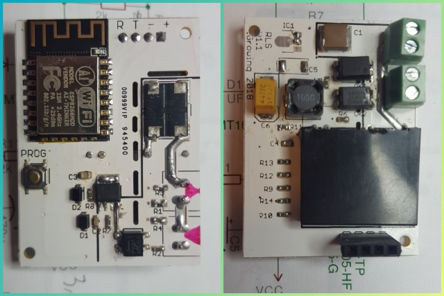
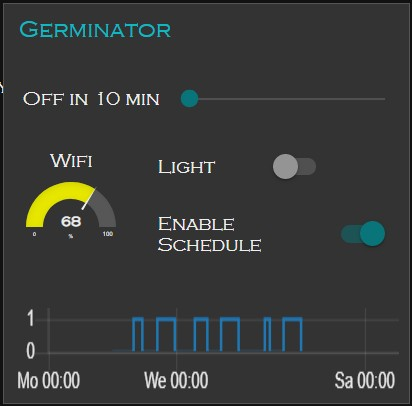

# YAWS - Yet Another WiFi Switch

## WARNING!!! DANGER!!! The switch uses non-isolated power supply. Keep safety rules while working with it out of isolated enclosure.

## Features:
- Turn switch on/off with button (like all others).
- Turn switch on/off via MQTT (like many others).
- Keep last state and restore it on power failure/restore (like some others).
- Firmware OTA (like some others).
- Report result of switching of relay (OK or Error, total 8 statuses).
- Report Error if power circuitry to load damaged, good for fused loads.
- Report Error if load is not connected: bulb burnt, for instance.
- Sensitve load status measure: 1W and up load, limited with relay current rating.
- 2A SSR silent click-less relay. Use your own relay type if needed. Match the bridge in current measurement circuit then.
- 80-240V 50/60Hz power supply, NON-ISOLATED for space saving. DO NOT TOUCH the circuit when powered on AC mains.
- Tiny size: 37x50mm



The YAWS is built on ESP8266 MCU, ESP-12 module with 4MB of Flash. Modules with 1MB of Flash fit too. WROOM-2 modules fit too and require redesign of the PCB.

The YAWS uses [Homie](https://github.com/marvinroger/homie-esp8266/) as firmware framework.
The YAWS is managed by any MQTT application on Tablet, Mobile phone, Laptop or Desktop.
[Node-Red](https://nodered.org/) is recommended for automated control of the switch: making cenes, automatic decisions, reporting, graphing, etc.

## Practical application
The YAWS can be used for:
- ceiling light control,
- utility/special light control,
- fan control,
- or, like in the example below, for germination of orchid seeds :)



Node-RED based example shows how to work with the YAWS.

## Initialization
Once the firmware is uploaded and the module is powered on, the Homie-xxxxxx AP will appear. It might take a minute or two if you use brand new ESP8266 with unwritten Flash. Homie will format the SPIFFS first.

Open Homie init portal: http://marvinroger.github.io/homie-esp8266/configurators/v2/
Switch your computer or cellphone to that Homie-AP.
Look in the portal when the new device will be recognized. This takes 5-25 secs.
Follow step-by-step on-screen instructions. DO NOT change the MQTT base name, leave it blank to avoid a bug in Homie. Allow OTA.
Once the setup finished, switch back to your regular network: now you'll Homie reports in your MQTT broker.


## Commands from the MQTT broker to YAWS
All the examples use mosquitto package in Linux. Feel free use your own broker. Topics and messages: that's what MQTT examples about.

You can turn light on/off by following MQTT commands accordingly:
```
mosquitto_pub -t /homie/unit-name/light/on/set -m 'true'
mosquitto_pub -t /homie/unit-name/light/on/set -m 'false'
mosquitto_pub -t /homie/unit-name/light/on/set -m 'toggle'
```
