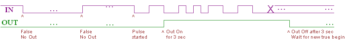

# ATtiny85 pulse detector

## Prolog
Schieber is constructed/built as self-sufficient device with zero-maintenance. That means it should produce enough electricity for its function.
And it should waste as less as possible to keep the enegy balance above 0.

Initially, it was planned to detect water flow by presence of voltage from inline hydrogenerator. That's simple solution. 
Its lack is: significant water flow needed to detect the voltage. I.e. weak flow (AKA leaks) won't count or be detected.

The water flow detector initially was powered by ESP8266 only for the time when there's significant water flow to measure. 
The reason was: cheap water flow Hall sensors are sensitive, wide flow range measuring and... energy wasting: 4-5mA.

## Problem
With some modification, I considered it as trade off to spend some electricity for precision of water flow detection. **Here the problem caught me.**
Tested 5 types of flow hall sensors. All Hall sensors don't keep known steady state. In no flow it's expected to be logical 1 output due to builtin pullup.
However, the sensor keep random 0 or 1 state in no flow. And rarely, once in few hours, it changes the state for some reason.

It was required:
- To reduce the steady current;
- To detect real water flow but not single state change.

## Solution
Fow steady current reduction it's easy: replace the pullup resistor in the water flow detector with 50kOhm one. This reduces current from 4-5mA to 1-2mA.

The ideal solution for pulse detection would CMOS-based electronic circuit. After dosens of failing experiments I gave up in favor of microcontroller.
ATTiny85 does the job for several uA. Fair enough, does the job.

## How does it work
* Ignore single logical level change.
* When periodic pulse detected (oscillations) drive external LDO.
* Keep itself in sleep mode for power save, wake on pin change interrupt.
* LED signaling is just for visual debug, not must. 3 long blinks on power on.
* Very short blink on edge changed. Very long blink on LDO/output enabled.
* 2 blinks when going to sleep. 3 blinks when awaken.  

### Graphical interpretation

# Power manager with ATtiny85

Power manager is a solution for more complicated problem than just differentiation of single edge change versus multiple pulses.
The table describes Power manager logic.

 State desc | Power btn pressed | ESP off,  water started | ESP sleeps, water started, unreal case | ESP went to sleep | ESP shuts down | false awake from water | ESP got stuck | powered on. Let ESP to decide when power off 
 -----------|-------------------|-------------------------|----------------------------------------|-------------------|----------------|------------------------|---------------|----------------------------------------------
 IO14/btn (IO4) | Rises | no matter? | on | Falls | Falls | no matter? | on | on 
 Water (IO0) | no matter | >3 edges | >3 edges | no matter | no matter | <3 edges | <3 edges | no matter
 Self was | sleep | sleep | sleep | wake | wake | sleep | wake | booted 
 for X ms |  | 3 sec | 3 sec | 10ms | >10ms | 3 sec | 30sec |  
 since… |  | awaken | awaken |  |  | awaken | last compare | 
  |  |  |  |  |  |  |  |  
 action IO2 | on | on | off | none | off | off | off | on 
 for X ms | 1sec | 1sec | 1sec -> on |  |  |  |  |  
 action self | no change | no change | no change | sleep | sleep | sleep | sleep | no change

For those who catches text better than table:
- Ignore single logical level change.
- When periodic edge change detected (oscillations) drive external LDO.
- Keep itself in sleep mode for power save, wake on pin change interrupt.
- ESP signals to ATtiny about power off or sleep mode. 
  - When Sleep signal sent, keep LDO on and ATtiny off. 
  - When shutdown signal sent, power off the LDO and itself.
- Serial prints for text debug.

# How to build/burn the ATtiny85 Digispark
1. Place ino file in same-name folder.
1. Prepare Arduino IDE as described: https://digistump.com/wiki/digispark/tutorials/connecting
1. Open the ino in Arduino. 
1. Click (=>) button of Arduino IDE to burn the sketch into Digispark.
1. Insert Digispark into USB port when prompted, not earlier!
1. Extract Digispark after flashing.
