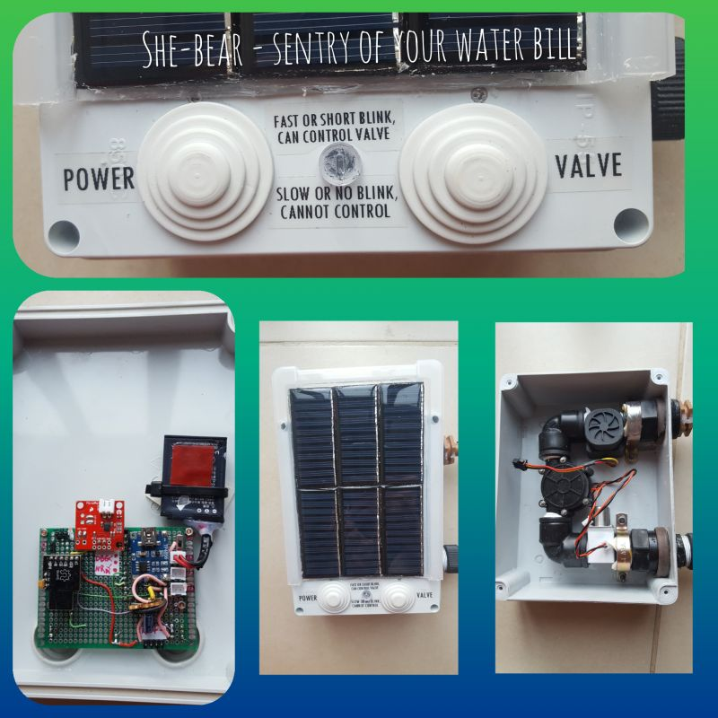

# Schieber: sentry of your water bill

## Why?
* Did you encounter the case when pipe is broken in the house when you are at work or on vacation? Flooding in the house followed with huge water bill and renovation bill.
* Did you exit your garden at morning and found that at night one of irrigation pipes diconnected or split? All the garden ruined with water, accompanied with bills.
* Do you know who's in your famility/guests wasting the most of water in your utility bill?
* You have 2 or more toilets or water-using appliances. Which of them OK and which is spending too much water (can be optimized)?
* Did your kid forget to close the tap? Is this repeating?
* Do you care about green future for next generations? Shouldn't people reduce waste of water... starting from yourself?

That's why you need the water control unit AKA Schieber (in German), שיבר (in Hebrew), She-bear (pronunciation). 

## Description
The she-bear consists of:
- Latching Valve + Hydrogenerator + Water flow Hall sensor, connected sequentially.
- MCU ESP8266 for main function + MCU ATtiny85 for power management + some electronics.
- Solar panel as spare energy source.
- Li-Ion cell as energy storage.

### Features
* Easy to install.
* Zero-maintenance. Fills the battery from water flow and from solar energy.
* Counts and reports water consumption via MQTT.
* Checks configurable amount of water and duration of single run.
* Alerts when amount or duration consumed by half.
* Shuts water off when amount or duration exceeded configured threshold.
* Configurable LED blink period while water is running.
* 2 button control: one button to awake the Schieber, other button to toggle the valve.
* MQTT control of the valve: open/close/toggle.
* When automatically shut off checks the MQTT messages every hour. Will open the valve if instructed via MQTT.
* Future support: Can accept emergency shut off command from ["leakage detector"](https://github.com/igrowing/esp8266_smart_home_ready/tree/master/modules/leakage_detector).




## How does it work
Normally, She-bear does nothing. :wink: Even almost does not consume energy from the built-in battery.

### Water
- When water is starting to run, the She-bear wakes up and counts the water flow.
- When water stops, the She-bear reports volume and duration of water consumption to your MQTT broker.
- If water is flowing by half of configured 'maximal duration' or 'maximal volume', the She-Bear sends alert to the MQTT broker. You might take action to locate the source of exaggerated flow.
- If water flow is exceeded the configured 'maximal duration' or 'maximal volume', the She-Bear closes the main valve (schiber) and sends alert notification to the MQTT broker.
- Future support: She-bear listens to messages from the 'leakage detectors' at your premises. Once leakage is detected, there is no sense to wait for significant damage in the house. So She-bear closes the valve immediately, even if the thresholds are not exceeded.
- When the valve is closed, obviously, no water can flow anymore. Therefore, there is no opportunity to the She-bear to awake. So it awakes every hour itself to check MQTT messages. You might configure your smart hub to open the valve. Or you might find and fix the leakage source and then oprn the valve.
- You can open or close the valve manually anytime by physical buttons.

### Power
She-bear is designed as zero-maintenance device. It fills its battery from built-in hydrogenerator while water is running. The power source is backed up with solar panel. Just for peace of mind, on every awake the She-bear reports to the MQTT broker the battery status. In case the battery is discharged, the appropriate alert is sent. The scenario when the battery can be discharged is:

1. The She-bear is installed in dark place, no solar energy.
1. Due to leakage the valve is automatically closed.
1. During 3-4 weeks no human attention appeared to open the valve.

That's pretty weird case, low probability to happen. So the She-bear is zero-maintenance. Frankly, Li-Ion battery might require replacement every 8-10 years.

### WebUI
TODO:
* Add Node-Red:
 * the flow
 * the flow picture
 * the UI screenshot
 
## How to install it
### Mechanical mount
TBD

### Initialization
Once the firmware is uploaded and the module is powered on, the Homie-xxxxxx AP will appear. It might take a minute or two if you use brand new ESP8266 with unwritten Flash. Homie will format the SPIFFS first.

* Open Homie init portal: http://marvinroger.github.io/homie-esp8266/configurators/v2/
* Switch your computer or cellphone to that Homie-AP.
* Look in the portal when the new device will be recognized. This takes 5-25 secs.
* Follow step-by-step on-screen instructions. DO NOT change the MQTT base name, leave it blank to avoid a bug in Homie. Allow OTA.
*  Once the setup finished, switch back to your regular network: now you'll Homie reports in your MQTT broker.

Alternatively, [few more methods of initialization explained](https://igrowing.livejournal.com/229070.html).

## How to control it
### Via MQTT
#### Reporting from the She-bear to MQTT broker
Every time the water is flowing or user presses the Power button, the She-bear publishes some important data to MQTT broker:
```
homie/shiber-01/$online true
homie/shiber-01/shiber/max-seconds 7200        // Configurable longest permitted water flow time
homie/shiber-01/shiber/max-liters 5000         // Configurable single time permitted water consumption
homie/shiber-01/shiber/ticks-denom 57          // Configurable divider. Used for conversion of flow sensor ticks to liters. ticks/denom=liters
homie/shiber-01/shiber/blink-liters 5          // Configurable period of LED blink while water is flowing
homie/shiber-01/shiber/battery  4.0 V          // Battery voltage report. Helps to monitor whether the charging is enough
homie/shiber-01/shiber/valve true              // Valve status. Changed by commands - see below.
homie/shiber-01/$stats/signal 82
homie/shiber-01/$stats/uptime 8
homie/shiber-01/shiber/water-seconds 14        // Water consumption report: time
homie/shiber-01/shiber/water-liters  6.4       // Water consumption report: volume
homie/shiber-01/shiber/status {"uptime":32,"br":6,"ticks":362,"action":"shutdown"}
homie/shiber-01/$online false
```

When valve is close (manually or automatically) the report includes:
```
homie/shiber-01/shiber/valve false
homie/shiber-01/shiber/status {"uptime":15,"br":6,"ticks":0,"action":"sleep"}
```
Examples of statuses and alerts:
```
homie/shiber-01/shiber/battery  3.2 V
homie/shiber-01/shiber/alert Low battery
...
homie/shiber-01/shiber/alert Failed to write variable to SPIFFS:...
homie/shiber-01/shiber/alert Valve not found on I2C
homie/shiber-01/shiber/alert {"reason":"Water is running, shutting off","time":"XXX","liters":"YYY"}
homie/shiber-01/shiber/alert {"reason":"Water is running","time":"XXX","liters":"YYY"}
...
homie/shiber-01/shiber/status Flash cleaned
```

#### Control via MQTT
Use ```mosquitto_pub -t <topic> -m <value>``` to control She-bear. The She-bear is receiving commands when it is on: either water running or woke up by Power button.

* Set valve:
```
homie/shiber-01/shiber/valve/set true
homie/shiber-01/shiber/valve/set false
homie/shiber-01/shiber/valve/set toggle
```
After control command the confirmation is sent to the broker:
```
homie/shiber-01/shiber/valve false        // or true, depends on command
```
* Set thresholds and variables:
```
homie/shiber-01/shiber/max-seconds/set 7500
homie/shiber-01/shiber/max-liters/set 3000
homie/shiber-01/shiber/ticks-denom/set 58
homie/shiber-01/shiber/blink-liters/set 7
```
See explanation of thresholds and variables in reporting examples.

### With buttons
If water is flowing, LED is rarely blinking:
* Press Valve button to toggle the valve. Expect LED stopped blinking.
  
If No water flow, LED is off:
* Press Power button to awake the She-bear.
* Wait few seconds: LED will blink slowly, then fast.
* While LED is blinking fast (15 seconds) press the Valve button to toggle the valve.

The She-bear will report to MQTT broker:
```
homie/shiber-01/shiber/status Change valve by button
homie/shiber-01/shiber/valve true          // or false, it's toggle
```
