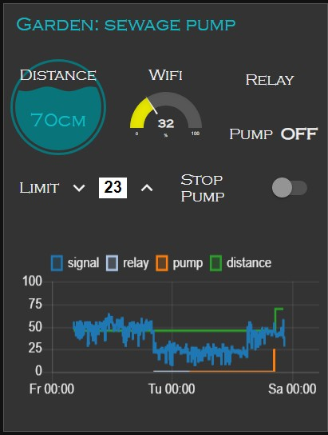

# Sewage pump controller

## Purpose

Couple of times my basement had suffered from ... well... sewage overflow due to different breaks in sewage pump. That's nasty and this must be terminated.

## Features


- Monitors level of water. When the level rises to the limit and not flushed by the pump, it sends me alert. Then i have day or two to replace the pump.
- Monitors pump work. If it works too long time (>5min in a row), it disables the pump for cooling for 10 minutes and sends me alert: this means the pump doesn't really flush.
- The Water level, the Pump work and the Controller status are published over MQTT.
- The water limit lever can be adjusted via MQTT.
- The pump can be disabled remotely: this is handy for maintenance.
- The pump can be disabled by local button click: this is handy for maintenance.
- Special "install-mode" allows to see the distance to water quickly in MQTT broker while installing the controller.



- The UI is made over Node-RED (works with no UI too).
- The circuit is equipped with surge protection, OVP, OCP, EMI features where needed.
- The sketch is implemented with ESP8266/ESP8285 over [Homie framework](https://github.com/marvinroger/homie-esp8266).


## Crucial design change
The JSN-SR04T sonar raised several troubles in the design:
1. It could not be too close to the switching power supply. It is very sensitive to EMI. Very serious EMI protection and isolation needed for it.
2. Its blue PCBA is not waterproof. The waterproof coating of the PCBA causes work stability problems. IP55 enclosure is not good enough for its protection from humidity. As result every 2-3 years the module needs to be replaced.
3. The transducer is waterproof. However, in 2-3 years the humidity of sewage pit destroys it.

As result, the current design uses [Maxbotix MB-7062 sonar](https://www.maxbotix.com/ultrasonic_sensors/mb7062.htm). It is 10 times more expensive than JSN-SR04T. Hoping it withstand better with humidity. It is easier to operate. It has larger range of distance detection. It has several types of outputs for choice and convenience.

> Obsolete! Originally, the distance meter module JSN-SR04T v.2.0 is planned to be mounted on the main PCB. It found to be sensitive, possible influenced from switching PSU. At the original placement the JSN-SR04T always returned minimal and not usable values. I tried to resolve the problem electronically by adding filters. Dozen variants tried. Only phisical distance from the mainboard solved the problem.
> 
> So, thinking out of the box _literally_, I placed the JSN-SR04T in separated waterproof box in the sewage pit. It's about 3m cable between the JSN-SR04T and the mainboard. Use reasonably shielded cable with 4 wires and ground the shield well.

## Initialization
Once the firmware is uploaded and the module is powered on, the Homie-xxxxxx AP will appear. It might take a minute or two if you use brand new ESP8266 with unwritten Flash. Homie will format the SPIFFS first.

- Open Homie init portal: http://marvinroger.github.io/homie-esp8266/configurators/v2/
- Switch your computer or cellphone to that Homie-AP.
- Look in the portal when the new device will be recognized. This takes 5-25 secs.
- Follow step-by-step on-screen instructions. DO NOT change the MQTT base name, leave it blank to avoid a bug in Homie. Allow OTA.
- Once the setup finished, switch back to your regular network: now you'll Homie reports in your MQTT broker.

## MQTT usage
### Reporting from the Pump controller to MQTT broker
When the room sensor is booted it publishes following to MQTT broker:

```
homie/pump/$homie 2.0.0
homie/pump/$mac 5C:CF:7F:1A:9B:FF
homie/pump/$name pump controller
homie/pump/$localip ip.ip.ip.ip
homie/pump/$stats/interval 0
homie/pump/$fw/name pump-control
homie/pump/$fw/version 1.0.2
homie/pump/$fw/checksum bd66326fd3aa80de77b99b21cb22a840
homie/pump/$implementation esp8266
homie/pump/$implementation/config {"wifi":{"ssid":"SSID"},"mqtt":{"host":"ip.ip.ip.ip","port":1883,"auth":false},"name":"pump controller","ota":{"enabled":true},"device_id":"pump"}
homie/pump/$implementation/version 2.0.0
homie/pump/$implementation/ota/enabled true
homie/pump/pump/$type controller
homie/pump/pump/$properties alert,pump,relay:settable,distance-threshold:settable,distance
homie/pump/$online true
homie/pump/pump/distance-threshold 23
```

Scenario of messages when pump works for long time. It covers alert example and distance measure:
```
homie/pump/pump/distance 24 cm
homie/pump/pump/pump on. Current = 3.1 A
...
homie/pump/pump/relay true
homie/pump/pump/alert Pump is on for long time
homie/pump/pump/pump off
...
homie/pump/pump/relay false
```

### Commands from the MQTT broker to Pump controller
All the examples use mosquitto package in Linux. Feel free use your own broker. Topics and messages: that's what MQTT examples about.

You can disable and enable the pump by following MQTT commands accordingly:
```
mosquitto_pub -t homie/pump/pump/relay/set -m 'true'
mosquitto_pub -t homie/pump/pump/relay/set -m 'false'
```

You can set a minimal distance of water level (limit) to trigger the alert:
```
mosquitto_pub -t homie/pump/pump/distance-threshold/set -m '60'
```

Reboot the pump controller:
```
mosquitto_pub -t homie/pump/pump/reset/set -m 'true'
```

You can enable install mode. It allows you to see the distance to water quickly in MQTT broker while installing the controller:
```
mosquitto_pub -t homie/pump/pump/install-mode/set -m 'true'
```
To exit the install mode and switch back to notmal mode you can do one of following:
1. Send `false` argument to the controller.
2. Power cycle the controller.
3. Click `Reset` hardware button.
